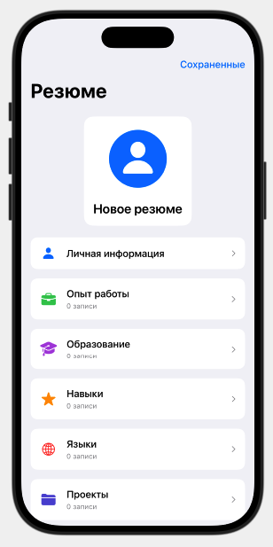
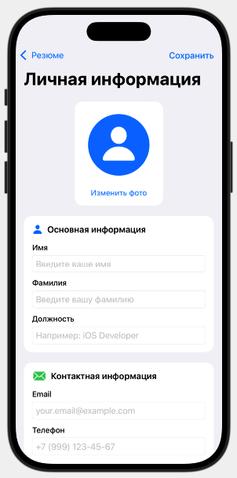
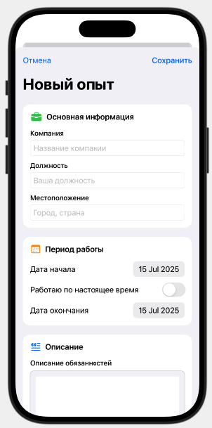
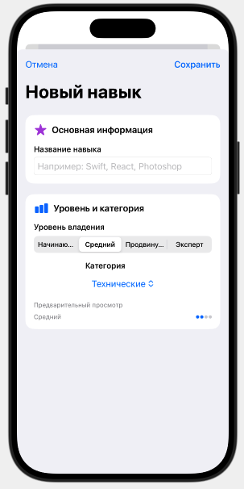
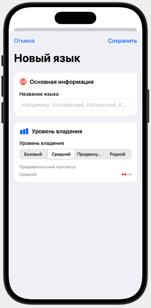
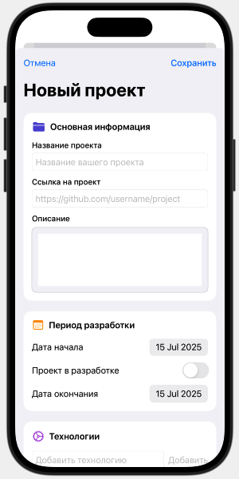
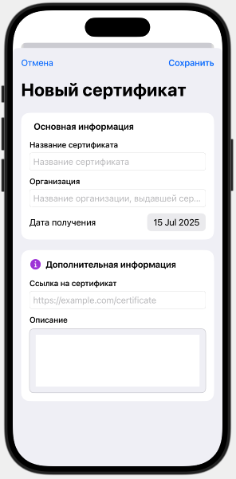

# 📸 Руководство по добавлению скриншотов

Этот файл содержит инструкции по добавлению скриншотов приложения в README.

## 📁 Структура папки screenshots

```
screenshots/
├── main-screen.png          # Главный экран с навигацией
├── personal-info.png        # Экран личной информации
├── experience.png           # Экран опыта работы
├── education.png            # Экран образования
├── skills.png               # Экран навыков
├── languages.png            # Экран языков
├── projects.png             # Экран проектов
├── certifications.png       # Экран сертификатов
├── saved-resumes.png        # Экран сохраненных резюме
└── export.png               # Экран экспорта
```

## 📱 Как сделать скриншоты

### 1. Запуск симулятора
```bash
# Откройте проект в Xcode
open resume-app.xcodeproj

# Запустите приложение на симуляторе iPhone 15
# Нажмите ⌘+R или кнопку "Run"
```

### 2. Создание скриншотов
1. **Главный экран** - откройте приложение и сделайте скриншот
2. **Личная информация** - нажмите на "Личная информация" и сделайте скриншот
3. **Опыт работы** - нажмите на "Опыт работы" и сделайте скриншот
4. **Образование** - нажмите на "Образование" и сделайте скриншот
5. **Навыки** - нажмите на "Навыки" и сделайте скриншот
6. **Языки** - нажмите на "Языки" и сделайте скриншот
7. **Проекты** - нажмите на "Проекты" и сделайте скриншот
8. **Сертификаты** - нажмите на "Сертификаты" и сделайте скриншот
9. **Сохраненные резюме** - нажмите "Сохраненные" и сделайте скриншот

### 3. Сохранение скриншотов
1. Создайте папку `screenshots` в корне проекта (если её нет)
2. Сохраните скриншоты с указанными именами
3. Убедитесь, что изображения имеют формат PNG

## 🎨 Рекомендации по скриншотам

### Размер и качество
- Используйте симулятор iPhone 15 для консистентности
- Разрешение: 1179 x 2556 пикселей
- Формат: PNG для лучшего качества
- Убедитесь, что текст читаем

### Содержание скриншотов
- **Главный экран** - покажите все разделы резюме
- **Разделы** - покажите форму с заполненными данными
- **Сохраненные резюме** - покажите список сохраненных резюме
- **Экспорт** - покажите меню экспорта

### Примеры хороших скриншотов
- Заполненные формы с реальными данными
- Показ функциональности (добавление, редактирование)
- Демонстрация красивого дизайна
- Показ навигации между экранами

## 🔄 Обновление README

После добавления скриншотов обновите секцию "Скриншоты" в README:

```markdown
## 📱 Скриншоты

### Главный экран


### Личная информация


### Опыт работы


### Образование


### Навыки


### Языки


### Проекты


### Сертификаты


### Сохраненные резюме

```

## 🚀 Автоматизация

Для автоматизации процесса создания скриншотов можно использовать:

### Fastlane Screengrab
```ruby
# fastlane/Screengfile
devices([
  "iPhone 15"
])

languages([
  "ru"
])

clear_previous_screenshots(true)
```

### Xcode UI Tests
```swift
// Создайте UI тесты для автоматического создания скриншотов
func testMainScreen() {
    let app = XCUIApplication()
    app.launch()
    
    // Сделайте скриншот
    let screenshot = app.screenshot()
    let attachment = XCTAttachment(screenshot: screenshot)
    attachment.name = "Main Screen"
    attachment.lifetime = .keepAlways
    add(attachment)
}
```

## 📝 Чек-лист

- [ ] Создана папка `screenshots/`
- [ ] Сделаны скриншоты всех основных экранов
- [ ] Скриншоты сохранены с правильными именами
- [ ] Обновлена секция "Скриншоты" в README
- [ ] Скриншоты показывают функциональность приложения
- [ ] Текст на скриншотах читаем
- [ ] Дизайн выглядит привлекательно

## 🎯 Цель

Хорошие скриншоты помогут:
- Показать функциональность приложения
- Привлечь внимание к проекту
- Объяснить, как работает приложение
- Увеличить количество звезд на GitHub

---

**Создавайте качественные скриншоты для лучшего представления вашего приложения!** 🚀 